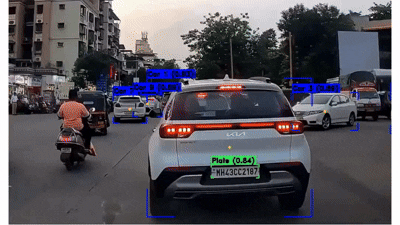

# 🚗 License Plate Recognition & Tracking System  

This project is a real-time **car detection, tracking, and license plate recognition system**, fine-tuned specifically on **Indian car models**. The system detects vehicles, captures their license plates, and automatically saves/renames them with unique car IDs. It is **quantized for efficiency**, achieving **high accuracy** while remaining lightweight for deployment.  

---

## Demo 🎥

 
---

## ✨ Features  
- 🔹 Real-time car detection & tracking (YOLO-based)  
- 🔹 Custom license plate detection & recognition model  
- 🔹 Automatic plate saving & renaming with car ID  
- 🔹 Works in **crowded traffic scenes** with no ID switch  
- 🔹 Quantized for performance on resource-limited devices  
- 🔹 Deployed on **Azure Cloud** for scalability  

---

## 🛠 Tech Stack  
- **YOLO** – Vehicle detection & tracking  
- **Custom Plate Recognition Model** – Trained for Indian plates  
- **OpenCV** – Image preprocessing  
- **Azure** – Deployment platform  

---

## 📊 Results  
- ✅ High accuracy in plate recognition  
- ✅ Stable tracking with no ID switching  
- ✅ Tested in **busy Indian traffic scenes**  

---

## 🚀 Future Improvements  
- Multi-country plate recognition support  
- Integration with databases for large-scale vehicle management  
- Edge device optimization for IoT cameras  

---

## 📂 Repository Structure  
